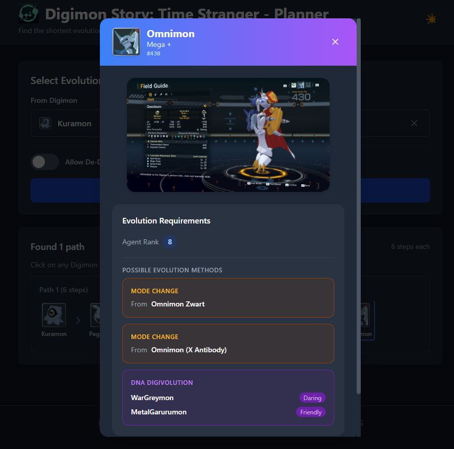
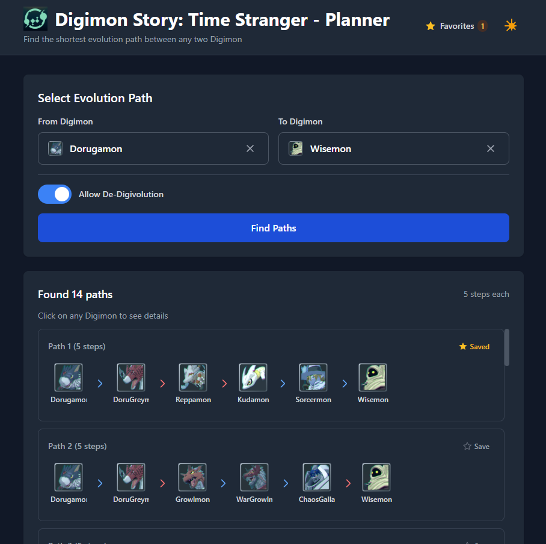

# Digimon Planner

A web app for **Digimon Story: Time Stranger** that finds the shortest evolution path between any two Digimon. Select a starting Digimon and a destination, and the app instantly computes every possible shortest route using BFS pathfinding.




---

## Features

- **Shortest path finder** — computes all equally-short evolution chains simultaneously, not just one
- **De-Digivolution toggle** — optionally allow backward evolution steps to open up new routes
- **Searchable Digimon selector** — filter across ~475 Digimon by name in real time
- **Detail modal** — click any Digimon in a path to see its full image, stats requirements, agent rank, and evolution methods (DNA Digivolution, Mode Change) with Digimon icons
- **Image zoom** — click the full image in the detail modal to open a fullscreen lightbox
- **Favorite paths** — save any evolution path, persist it across sessions, and reload it instantly from the Favorites modal
- **Dark / light theme** — persisted across sessions

---

## Tech Stack

| Layer | Technology |
|---|---|
| Frontend | React 18, Vite, Tailwind CSS |
| Backend | Node.js, Express |
| Data | Static JSON (~475 Digimon, no database) |
| Algorithm | BFS (Breadth-First Search) |

---

## Getting Started

### Prerequisites

- Node.js ≥ 14

### Installation

```bash
git clone https://github.com/FedeFiguerola/digimon-planner.git
cd digimon-planner
npm install
```

### Running in development

You need two terminals running simultaneously:

```bash
# Terminal 1 — Express API (port 3000)
npm run api

# Terminal 2 — Vite dev server (port 5173)
npm run dev:vite
```

Then open [http://localhost:5173](http://localhost:5173).

The Vite dev server proxies all `/api/*` requests to Express, so both run as a single app from the browser's perspective.

### Production build

```bash
npm run dev:build    # builds frontend to dist/
npm run dev:preview  # serves the production build locally
```

---

## How to Use

1. **Select a starting Digimon** from the "From" dropdown — type to search
2. **Select a destination Digimon** from the "To" dropdown
3. Optionally enable **Allow De-Digivolution** to include backward evolution steps
4. Click **Find Paths**
5. All shortest evolution chains are displayed as visual cards
6. Click the **★ Save** button on any path card to save it to your favorites
7. Click any Digimon icon in a path to open its **detail modal** — full image, evolution requirements, and Digimon icons for DNA / Mode Change methods
8. Click the image in the detail modal to open it in a **fullscreen lightbox**
9. Click **Favorites** in the header to view, reload, or remove saved paths

---

## Project Structure

```
digimon-planner/
├── src/                  # React frontend
│   ├── api/              # Fetch wrappers (single HTTP layer)
│   ├── components/       # UI components
│   ├── context/          # Theme context
│   ├── hooks/            # useDigimon, useEvolutionPath, useFavorites
│   └── App.jsx
├── app/                  # Express backend
│   ├── routes/           # Thin route controllers
│   └── services/         # Business logic
├── core/
│   └── pathfinder.js     # DigimonGraph class + BFS algorithm
├── data/
│   └── processed/
│       └── digimon.json  # Full Digimon dataset
└── server.js             # Express entry point
```

---

## API

| Method | Endpoint | Description |
|---|---|---|
| GET | `/health` | Service health check |
| GET | `/digimon` | List all Digimon (optional `?search=`) |
| GET | `/digimon/:id` | Get Digimon by ID |
| GET | `/digimon/name/:name` | Get Digimon by name (case-insensitive) |
| POST | `/path` | Find shortest evolution paths |

**Path request example:**
```json
{
  "from": "Agumon",
  "to": "Omnimon",
  "allowDeDigivolve": false,
  "enriched": true
}
```

---

## Notes

- Digimon data was scraped from [Game8](https://game8.co) and [Grindosaur](https://www.grindosaur.com) and is stored as a static JSON file. No database is required.
- Digimon images are hotlinked from external sources. If those URLs change, the modal falls back to a text placeholder.
- Some Digimon have no evolution connections in the game and will return no path.
- Favorite paths are stored in `localStorage` and persist across sessions. They store the full enriched path data at save time.

---

## License

MIT
